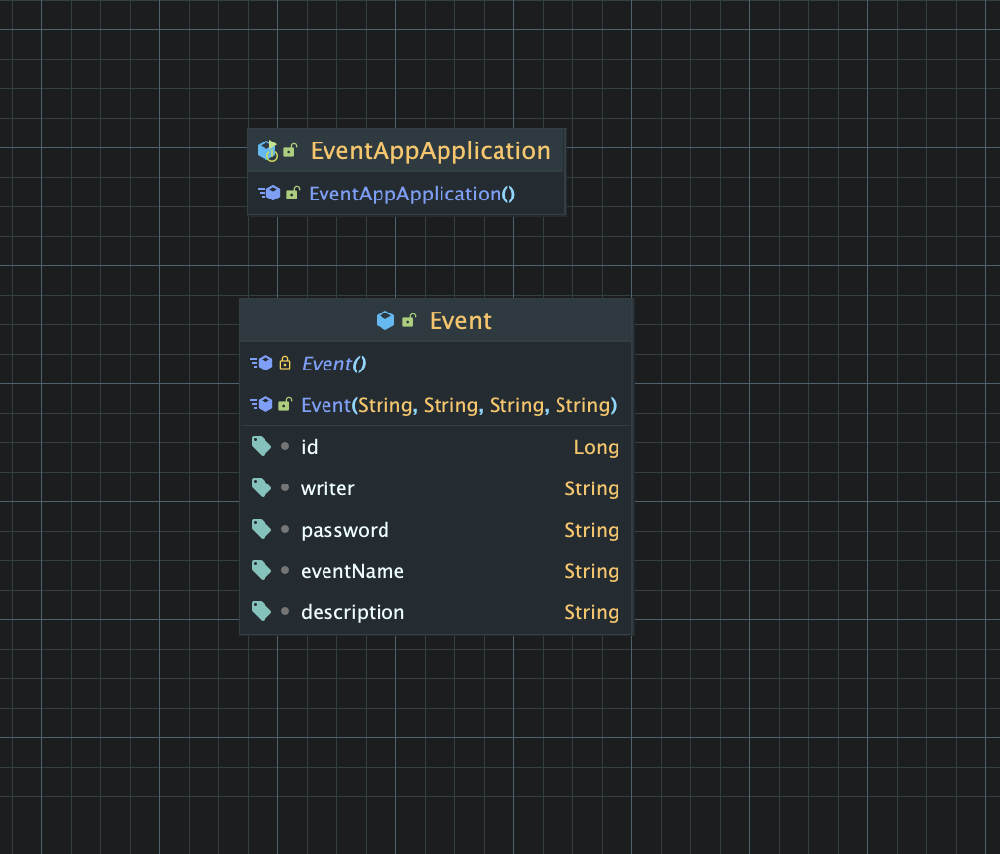

# calanderApp API
일정 관리 앱 만들기 과제 레포지토리입니다.<br>

## 사용된 기술 및 실행환경


### 실행환경
- **IDE** : IntelliJ IDEA
- **JDK 버전** : OpenJDK 17
- **Framework** : Spring Boot
- **빌드 도구** : Gradle (Groovy DSL)
- **Database** : MySQL 8.0 (개발용)
- **API 테스트 도구** : Postman

## 과제의 목표
- 기본 CRUD 기능을 통해 3 Layer Architecture 구조를 익히고, DTO, JPA, ResponseEntity를 활용해 안정적인 데이터 처리를 경험
- 도전단계에서는 댓글, 단건 조회 확장, 입력 검증 등을 추가하며 구조적 완성도 높이기

## 프로젝트 구조
<pre>
**calanderApp**

📂 src/com/java/com/calanderapp
├───── 📂 controller/       
│      ├── .java           // 
├───── 📂 dto/
│      └── .java    // 
├───── 📂 entity/
├───── 📂 repository/
├───── 📂 service/
└───── CalanderAppApplication.java     // 
</pre>

#### 3 Layer Architecture 관점
- **Controller Layer**
    - `작성예정`
- **Service Layer**
    - `작성예정`
- **Repository Layer**
    - `작성예정`

## 필수기능
- Lv.0 API 명세 및 ERD 작성
  - [ ] API 명세서 작성하기
  - [ ] ERD 작성하기
- Lv.1 일정 생성
  - [ ] 일정 생성(일정 작성하기)
- Lv.2 일정 조회
  - [ ] 전체 일정 조회
  - [ ] 선택 일정 조회
- Lv.3 일정 수정
  - [ ] 선택 일정 수정
- Lv.4 일정 삭제

## 도전기능
- Lv.5 댓글 생성
  - [ ] 일정에 댓글 작성하기
- Lv.6 일정 단건 조회 업그레이드
- Lv.7 유저의 입력에 대한 검증 수행 

### 📈 확장/테스트 기능


## 🧩 실행 방법
1. `작성예정`


---

## 📘 API 명세서
### 1️⃣ 일정 생성 (POST /api/events)
> 새 일정을 등록합니다.

**요청 예시**
```json
{
  "eventName": "팀 회의",
  "description": "이번 주 업무 공유",
  "writerName": "서재원",
  "password": "1234"
}
```

**응답 예시 (201 Created)**
```json
{
  "id": 1,
  "eventName": "팀 회의",
  "description": "이번 주 업무 공유",
  "writerName": "서재원",
  "createdAt": "2025-10-17T10:00:00"
}
```

---

### 2️⃣ 일정 수정 (PUT /api/events/{id})
> 등록된 일정을 수정합니다.  
> `id`는 수정할 일정의 고유 식별자입니다.

**요청 예시**
```json
{
  "eventName": "팀 회의 (수정)",
  "description": "회의 일정 변경",
  "writerName": "서재원",
  "password": "1234"
}
```

**응답 예시 (200 OK)**
```json
{
  "id": 1,
  "eventName": "팀 회의 (수정)",
  "description": "회의 일정 변경",
  "writerName": "서재원",
  "createdAt": "2025-10-17T10:00:00",
  "modifiedAt": "2025-10-17T11:00:00"
}
```

**응답 코드**

| 코드 | 설명 |
|------|------|
| 200 | 일정 수정 성공 |
| 201 | 일정 생성 성공 |
| 400 | 잘못된 요청 데이터 (필드 누락/유효성 실패) |
| 401 | 비밀번호 불일치 (권한 없음) |
| 404 | 해당 ID의 일정이 존재하지 않음 |

--- 
## 🗃️ ERD (초기 설계)

> IntelliJ Diagram 캡처본 (Event 중심 초기 구조)